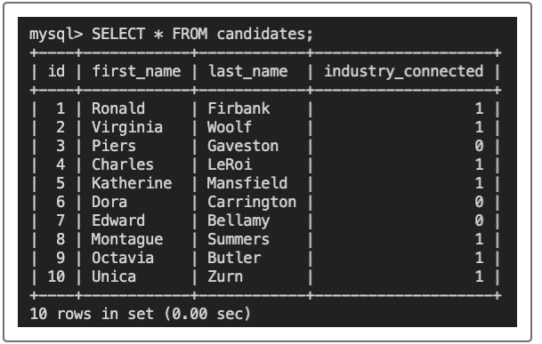

# u-develop-it
Module 12 SQL: Database

## Purpose
Build the back end for U Vote It, a voting application for a local developer meetup group called U Develop It. 
Connect the back end to a relational database using MySQL.

## Built With
* MySQL
* MySQL2
* Git Hub

## Contribution
Made with ❤️ by Samantha Malone
Shout out to my tutor
© 2021 Samantha Malone. All rights reserved.

